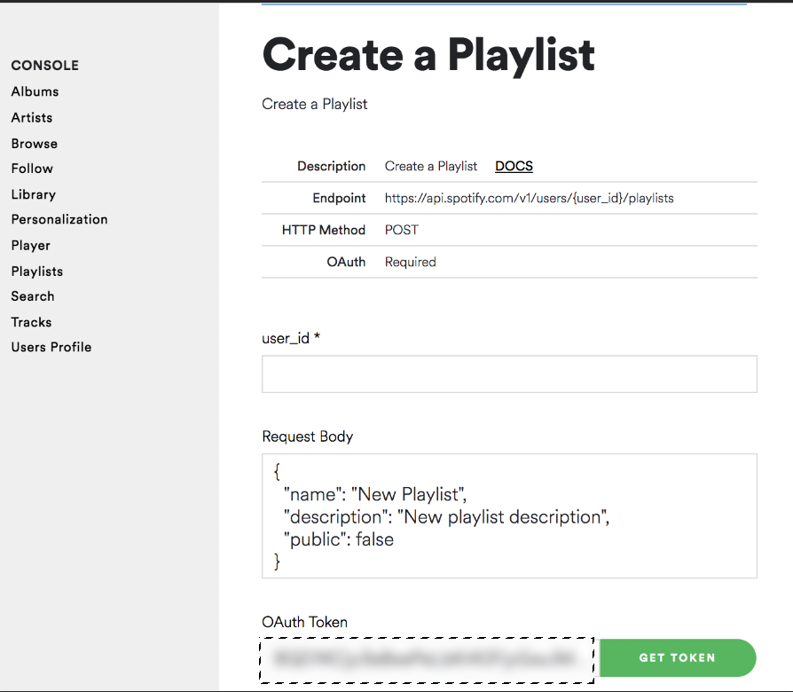
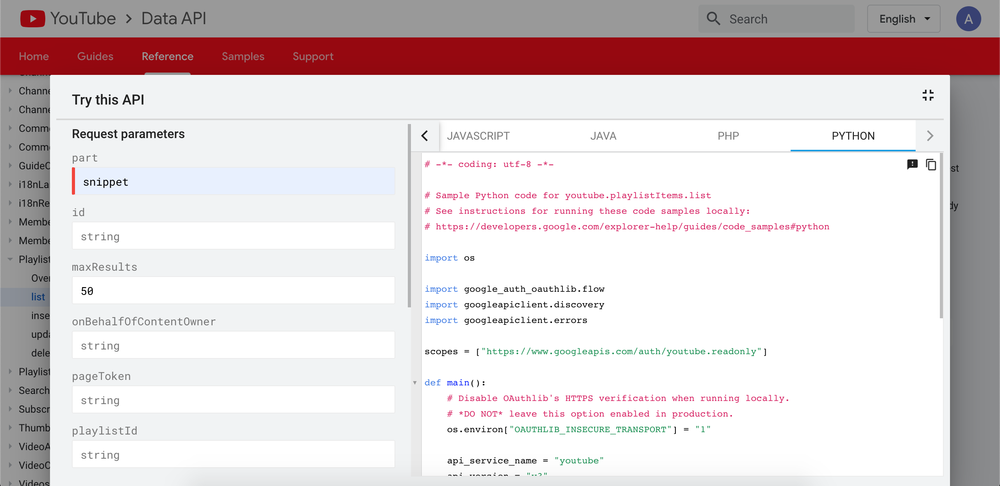
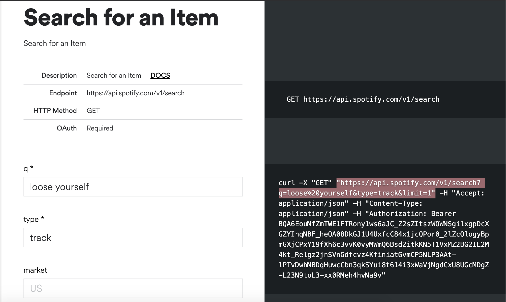

# Generate Spotify playlist from a Youtube playlist
##### Get all your favourite songs on spotify now
A script that takes a name of the playlist on Youtube, and generates a Spotify playlist based on the song in that playlist.

## Table of Contents
* [Technologies](#Technologies)
* [Setup](#LocalSetup)
* [ToDo](#ToDo)
* [Troubleshooting](#Troubleshooting)
* [Debugging](#Debugging)
* [API_Documentation](#API_Documentation)
* [Acknowledgement](#Acknowledgement)

## Technologies
* [Youtube Data API v3]
* [Spotify Web API]
* [Requests Library v 2.22.0]
* [Youtube_dl v 2020.01.24]

## LocalSetup
1) Install [python3] and [virtualenv] and than install dependancies in that venv   
Open terminal and run
```python
virtualenv venv # create a virtual environmnet
source venv/bin/activate #start using that environmnet 
pip3 install -r requirements.txt # install all required packages
``` 


2) Collect You Spotify User ID and Oauth Token From Spotfiy and add it to secrets.py file
    * To Collect your User ID, Log into Spotify then go here: [Account Overview] and its your **Username**
    
    * To Collect your Oauth Token, Visit this url here: [Get Oauth] and click the **Get Token** button
     . Check all boxes when you click on get token. Remember this token expires quickly so you might need to update it when ever you run this

3) Enable Oauth For Youtube and download the client_secret.json   file
     Just follow the guide here [Set Up Youtube Oauth] 
    - Go to [console google]
    - Go to credentials
    - Create credential and choose OAuth client id
    - Application type as desktop app
    - Give any name
    - Simple Download it and save name as "YOUR_CLIENT_SECRET_FILE.json"   
    For more information visit [How to make OAuth]
   

4) Run the File  
Run following command in the terminal
```json
python3 add_songs.py "your_playlist_name"
```
    * you'll immediately see `Please visit this URL to authorize this application: <some long url>`
    * click on it and log into your Google Account to collect the `authorization code` and then paste it back it


## ToDo
Write more useful Readme and put better comments in the code

## Troubleshooting
* Spotify Oauth token expires very quickly, If you come across a `KeyError` this could
be caused by an expired token. So just refer back to step 3 in local setup, and generate a new token!  

## Debugging 

* Run the file in interactive mode
```json
python3 -i add_songs.py "your_playlist_name"
```
* See which function gave you that error. Save all previous variables in shelve (shown in next step)
* Try saving any variables (e.g youtube,spotify_playlist_id) in a shelve. So you dont have to authorise permission from Google each time we run it or run all previous functions again.
```
with shelve.open('shelve.db') as db:
         db["youtube"] = youtube
         db["spotify_playlist_id"]=spotify_playlist_id
```
* Then try fixing the code
* Re run the script and load all previous variables like
```
with shelve.open('shelve.db') as db:
         youtube = db["youtube"]
         spotify_playlist_id = db["spotify_playlist_id"]
```
* Then run only the functin that was giving the error
* Hopefully this will make debugging easy 

## API_Documentation
- [Youtube list items in a playlist Api] 

- [Spotify search API]


## Acknowledgement  
* Inspired from [The come up]. Check her [Youtube Video]
* Fixes some issues in it and increases it's scope to use any playlist in youtube

## Cheers
Feel free to fork, fix and add more features
RC

   [Youtube Data API v3]: <https://developers.google.com/youtube/v3>
   [Spotify Web API]: <https://developer.spotify.com/documentation/web-api/>
   [Requests Library v 2.22.0]: <https://requests.readthedocs.io/en/master/>
   [Youtube_dl v 2020.01.24]:<https://github.com/ytdl-org/youtube-dl/>
   
   [virtualenv]:<https://packaging.python.org/guides/installing-using-pip-and-virtual-environments/>
   [python3]:<https://www.python.org/downloads/>

   [Account Overview]: <https://www.spotify.com/us/account/overview/>
   [Get Oauth]: <https://developer.spotify.com/console/post-playlists/>

   [console google]:<https://console.developers.google.com/>
   [How to make OAuth]:<https://developers.google.com/youtube/v3/guides/auth/installed-apps>
   [Set Up Youtube Oauth]: <https://developers.google.com/identity/protocols/oauth2>

   [Youtube list items in a playlist Api]:<https://developers.google.com/youtube/v3/docs/playlistItems/list>
   [Spotify search API]:<https://developer.spotify.com/console/get-search-item/>

   [The come up]:<https://github.com/TheComeUpCode/SpotifyGeneratePlaylist>
   [Youtube Video]:<https://www.youtube.com/watch?v=7J_qcttfnJA/>
   
   
